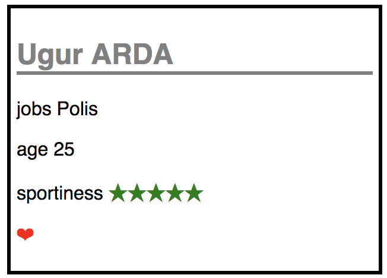

# React Dersi

## Create a Person component

- [x] create a Person component
- [x] creaate a Star component
- [x] Style the component

## Add favorite attribute

- [ ] Add fovorite attribute
- [ ] Use red color for styling

```jsx
<person ...  sportive={3} favorite={true} />
<person ...  sportive={5} favorite={false} />
```


